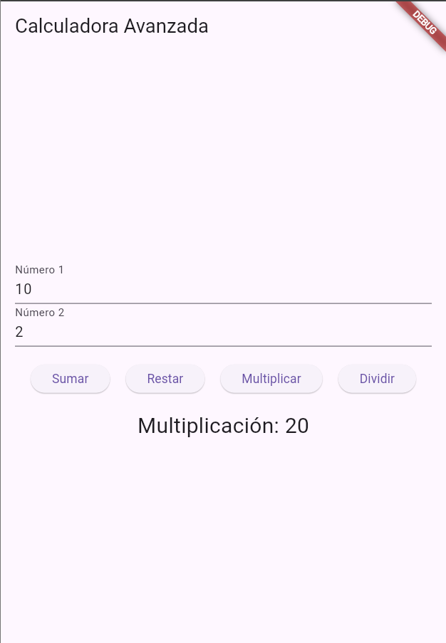
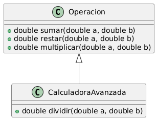

# Operación Matemática

Este proyecto presenta una implementación de una calculadora simple en Flutter que realiza operaciones matemáticas básicas: suma, resta y multiplicación. Se ha creado una clase abstracta `Operacion` con estos métodos y una clase derivada `CalculadoraAvanzada` que extiende de `Operacion`.

## Descripción del Ejercicio

**Ejercicio 2:**  
Realizar una clase `Operacion` con los métodos `suma`, `resta` y `multiplicación`. Luego, extender esta clase en una clase derivada llamada `CalculadoraAvanzada`.

### Resultado

El proyecto proporciona una interfaz gráfica donde los usuarios pueden ingresar dos números y seleccionar la operación que desean realizar. 



### Diagrama de Clases

El diagrama de clases muestra la estructura del código y la relación entre las clases `Operacion` y `CalculadoraAvanzada`.



## Estructura del Proyecto

- `lib/main.dart`: Archivo principal que contiene la implementación de la calculadora y la interfaz de usuario.
- `pubspec.yaml`: Archivo de configuración del proyecto.

## Cómo Acceder a la Rama `ejercicio2`

Para acceder a la rama `ejercicio2` y ver la implementación del ejercicio, sigue estos pasos:

1. **Clona el Repositorio**:
   Abre la terminal y clona el repositorio usando el siguiente comando:
   ```bash
   git clone https://github.com/german654/operacion_matematica1.git
2. **Cambia a la Carpeta del Proyecto**:

    ```bash
    cd calculadora-flutter
    ```

3. **Cambia a la Rama ejercicio2: Para acceder a la rama específica del ejercicio, ejecuta el siguiente comando**:

    ```bash
    git checkout ejercicio2
    ```

4. **Ejecuta el Proyecto: Asegúrate de tener Flutter instalado y configurado. Luego, ejecuta el proyecto con**:

    ```bash
    flutter run
    ```
