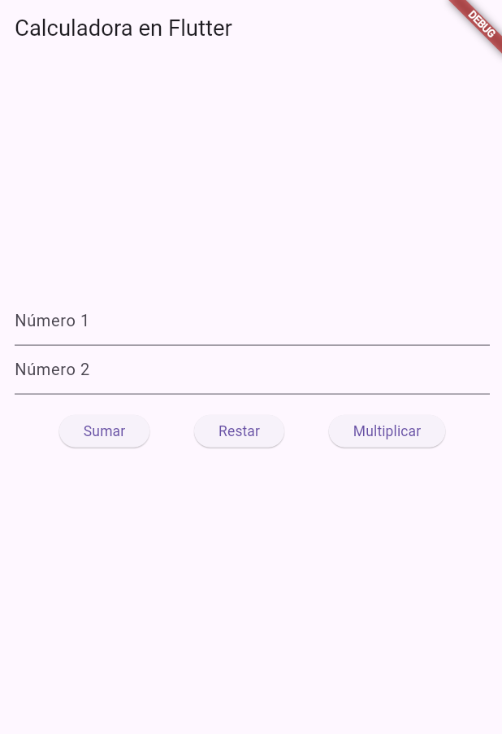
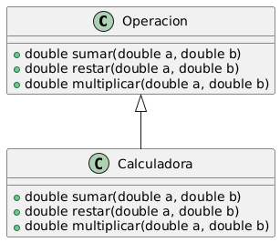

# Operación Matemática

## Ejercicio 01

**Objetivo:**  
Elaborar una clase abstracta `Operacion` con los métodos `suma`, `resta` y `multiplicación`. Luego, implementar estos métodos en una clase derivada llamada `Calculadora`.

## Descripción del Ejercicio

Este proyecto consiste en una calculadora básica en Flutter que permite realizar operaciones matemáticas simples. Se define una clase abstracta `Operacion`, que contiene los métodos para las operaciones básicas, y se implementa en la clase `Calculadora`.

### Resultado

El proyecto proporciona una interfaz gráfica donde los usuarios pueden ingresar dos números y seleccionar la operación que desean realizar. 



### Diagrama de Clases

El diagrama de clases muestra la estructura del código y la relación entre las clases `Operacion` y `CalculadoraAvanzada`.



## Estructura del Proyecto

- `lib/main.dart`: Archivo principal que contiene la implementación de la calculadora y la interfaz de usuario.
- `pubspec.yaml`: Archivo de configuración del proyecto.

## Cómo Acceder a la Rama `ejercicio1` que es main por defecto

Para acceder a la rama `main` y ver la implementación del ejercicio, sigue estos pasos:

1. **Clona el Repositorio**:
   Abre la terminal y clona el repositorio usando el siguiente comando:
   ```bash
   git clone https://github.com/german654/operacion_matematica1.git
2. **Cambia a la Carpeta del Proyecto**:

    ```bash
    cd operacion_matematica
    ```

3. **Cambia a la Rama main: Para acceder a la rama específica del ejercicio, ejecuta el siguiente comando**:

    ```bash
    git checkout main
    ```

4. **Ejecuta el Proyecto: Asegúrate de tener Flutter instalado y configurado. Luego, ejecuta el proyecto con**:

    ```bash
    flutter run
    ```